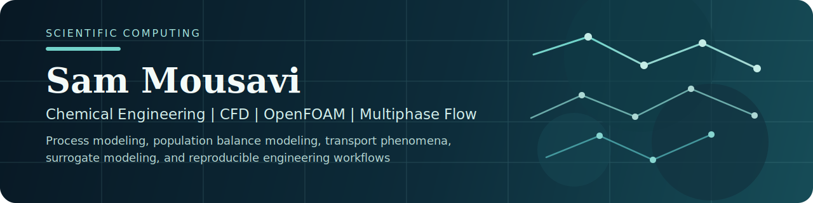

  

<h1 align="center">Sam Mousavi</h1>

  Chemical Engineering PhD Researcher at Aalto University

  CFD | OpenFOAM | Multiphase Flow | Process Modelling | Scientific Computing

  
  
  
  

---

## Profile

PhD researcher in Chemical Engineering based in Espoo, Finland, with research centered on multiphase flow, liquid-liquid extraction, emulsion separation, and process modelling. The work combines CFD, population balance modelling, Aspen-based process simulation, and scientific programming to develop practical engineering tools for complex fluid systems.

Background spans academic research, engineering modelling, and software development, with day-to-day work in OpenFOAM, Python, Matlab, C++, Aspen Plus, and Aspen Custom Modeler. GitHub is used to publish OpenFOAM developments, simulation case studies, and reproducible computational workflows.

  
  

---

## Research and Engineering Focus

- Liquid-liquid extraction and phase separation modelling
- OpenFOAM development and custom CFD workflows
- Population balance modelling and CFD coupling
- Surrogate modelling and optimization for engineering systems
- Reproducible scientific computing for chemical and process engineering

## Featured Repositories

| Repository | Focus |
| --- | --- |
| [Introduction-to-Programming-in-OpenFOAM-12](https://github.com/SamMousaviES/Introduction-to-Programming-in-OpenFOAM-12) | Teaching-oriented OpenFOAM 12 examples covering solver structure, custom models, and implementation fundamentals. |
| [ScalarTransportFoam](https://github.com/SamMousaviES/ScalarTransportFoam) | Custom OpenFOAM 12 solver extending the PitzDaily case with scalar transport capability. |
| [micromodelWaterAirInjection](https://github.com/SamMousaviES/micromodelWaterAirInjection) | Micromodel simulations for water and air injection using `multiphaseInterFoam`. |
| [of11_TrickleBed](https://github.com/SamMousaviES/of11_TrickleBed) | OpenFOAM-based multiphase trickle-bed simulation work. |
| [Karman-Vortex-Street](https://github.com/SamMousaviES/Karman-Vortex-Street) | Flow visualization and vortex shedding study around a cylinder wake. |

## Publications and Research

- Author of 7 peer-reviewed publications across chemical engineering, CFD, porous media, and machine-learning-assisted reservoir optimization
- Current doctoral work focuses on liquid-liquid extraction, droplet population balance modelling, surfactant-influenced separation systems, and validation against experimental and pilot data
- Interested in translating research models into practical, well-documented computational tools for engineering use

## Technical Stack

- Programming: Python, Matlab, Bash, C++
- Simulation: OpenFOAM, Aspen Plus, Aspen Custom Modeler, Ansys Fluent, COMSOL
- Data and ML: NumPy, Pandas, Matplotlib, Jupyter, scikit-learn, Power BI
- Engineering domains: transport phenomena, mass transfer, heat transfer, multiphase flow, process simulation, and population balance modelling

## Collaboration

I am interested in collaboration around OpenFOAM extensions, CFD workflows, multiphase flow modelling, and scientific software for chemical and process engineering.
